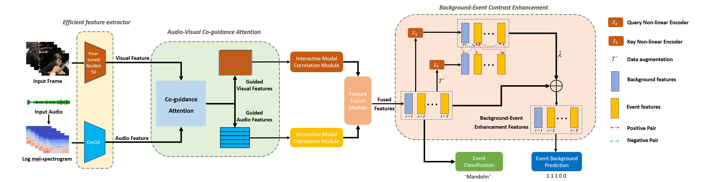
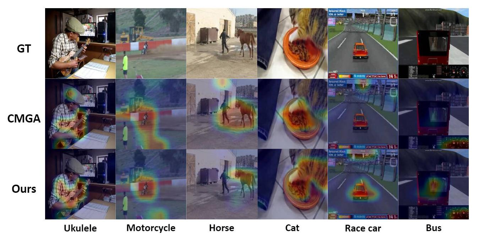

# CACE-Net

Here is the PyTorch implementation of our paper.

**Paper Title: "CACE-Net: Co-guidance Attention and Contrastive Enhancement for Effective Audio-Visual Event Localization"**

**Authors: Xiang He\*, Xiangxi Liu\*, Yang Li\*, Dongcheng Zhao, Guobin Shen, Qingqun Kong,  Xin Yang, Yi Zeng**

**Accepted by: MM '24: Proceedings of the 32st ACM International Conference on Multimedia**

\[[arxiv]()\] \[[paper]()\] \[[code](https://github.com/Brain-Cog-Lab/CACE-Net)\]



<p align="center">   <strong>Figure 1: Method Overview showing the main components of CACE-Net.</strong> </p>

## Content tree

This repository contains three folders, AVELCLIP, CACE, and Encoders, for Targeted fine-tuning, CACE-Net, and efficient encoders, respectively.

```
+---AVELCLIP  # Targeted fine-tuning
|   \---audioset_tagging_cnn
|       +---checkpoints
|       +---clip
|       +---pytorch
|       +---resources
|       +---scripts
|       \---utils
+---CACE  # CACE-Net
|   +---braincog
|   +---configs
|   +---data
|   +---dataset
|   +---model
|   \---utils
\---Encoders  # efficient encoders
    \---audioset_tagging_cnn
        +---pytorch
        +---resources
        +---scripts
        \---utils
```


## AVE Dataset & Features Prepare

We highly appreciate [@YapengTian](https://github.com/YapengTian/AVE-ECCV18) for the shared features and code.

###  Download Raw Video

The AVE dataset is a subset of the AudioSet, which contains 4097 videos with a total of 28 event categories and 1 background category. The dataset can be obtained from [https://drive.google.com/open?id=1FjKwe79e0u96vdjIVwfRQ1V6SoDHe7kK](https://drive.google.com/open?id=1FjKwe79e0u96vdjIVwfRQ1V6SoDHe7kK).

### Download Visual and Audio Features

The [AVE-ECCV18](https://github.com/YapengTian/AVE-ECCV18) repository offers the results of feature extraction from videos using the Vggish audio model pre-trained on the Audioset dataset and the Vgg-19 visual model pre-trained on the ImageNet dataset.

Note that the number of features here is 4143 instead of 4097 because a video may belong to different categories at the same time.


## Usage

### Train

If you want to retrain yourself to verify the results in the paper, please refer to the commands in scripts [run_aba.sh](./run_aba.sh) and [run_supp.sh](./run_supp.sh). 

As an example, the script for using our method on the AVE dataset would look like this:

```shell
CUDA_VISIBLE_DEVICES=1 python supv_main.py --gpu 1 --lr 0.0007 --clip_gradient 0.5 --snapshot_pref "./Exps/Supv_supp/expLoss" --n_epoch 200 --b 64 --test_batch_size 64 --print_freq 10 --seed 3917 --guide Co-Guide --psai 0.3 --contrastive --Lambda 0.6 --contras_coeff 1.0  # This will get 80.796% accuracy, results in our paper.
```

This took about 0.5h on a 40G-A100 GPU

### validation 

We also provide model weights for the experimental results in the paper. The well-trained model can be found at [here](https://huggingface.co/xianghe/cace-net/tree/main).

The script for validation can be：

```bash
CUDA_VISIBLE_DEVICES=1 python supv_main.py --seed 3917 --gpu 1 --test_batch_size 64 --guide Co-Guide --psai 0.3 --contrastive --Lambda 0.6 --contras_coeff 1.0 --evaluate --resume /home/hexiang/CACE/Exps/Supv_supp/expLoss_Seed3917_guide_Co-Guide_psai_0.3_Contrastive_True_contras-coeff_1.0__lambda_0.6/model_epoch_46_top1_80.796_task_Supervised_best_model_psai_0.3_lambda_0.6.pth.tar
```

The output results are as follows:

```bash
Loading Checkpoint: /home/hexiang/CACE/Exps/Supv_supp/expLoss_Seed3917_guide_Co-Guide_psai_0.3_Contrastive_True_contras-coeff_1.0__lambda_0.6/model_epoch_46_top1_80.796_task_Supervised_best_model_psai_0.3_lambda_0.6.pth.tar

2024-07-17 03:57:14,726 INFO
Start Evaluation..
2024-07-17 03:57:16,209 INFO Test Epoch [0][0/7]        Loss 2.2928 (2.2928)    Prec@1 75.000 (75.000)
2024-07-17 03:57:16,532 INFO **************************************************************************         Evaluation results (acc): 80.7960%.
2024-07-17 03:57:16,532 INFO completed in 1.81 seconds.
```


## Re-extraction of features (optional)

Using the features provided in [AVE-ECCV18](https://github.com/YapengTian/AVE-ECCV18) for comparison with other methods is a fair approach. If you want to further improve task performance, consider using more efficient encoders to extract features.

### Video frame and audio file extraction

- Video frame extraction: We use `cv2.VideoCapture`, please refer to the file [visual_feature_extractor.py](./Encoders/visual_feature_extractor.py).
- Audio file extraction: We use `moviepy`, please refer to the file [audioclip.py](audioclip.py)

### efficient encoders

- Visual Encoder: We use `ResNet50`, `EfficientNet` is also ok.  Please refer to the file [visual_feature_extractor.py](./Encoders/visual_feature_extractor.py).
- Audio Encoder: We use `CNN14`, from [PANN](https://github.com/qiuqiangkong/audioset_tagging_cnn). Please refer to the file [inference.py](./Encoders/audioset_tagging_cnn/pytorch/inference.py).

The commands for extracting audio features are as follows:

```bash
python inference.py audio_tagging --model_type Cnn14 --checkpoint_path /home/hexiang/Encoders/audioset_tagging_cnn/checkpoints/Cnn14_mAP=0.431.pth --audio_path="non.wav" --cuda
```

### Targeted fine-tuning

In efficient encoders, pre-trained models can be fine-tuned specifically for audio-visual localization tasks to obtain more generalized representations.

The fine-tuning script is shown below:

```bash
python main.py --batch-size 128 --dist-url 'tcp://localhost:10001' --multiprocessing-distributed --world-size 1 --rank 0
```


## Results on AVE dataset

| AVCA | BECE | Efficient Encoder | Accuracy(%) |
| :--: | :--: | :---------------: | :---------: |
|  -   |  -   |         -         |    78.83    |
|  ✓   |      |                   |    78.93    |
|      |  ✓   |                   |    80.30    |
|  ✓   |  ✓   |                   |    80.80    |
|  ✓   |  ✓   |         ✓         |  **82.36**  |




<p align="center">   <strong>Figure 2: Visualization of different attention guidance methods.</strong> </p>

## Citation

If our paper is useful for your research, please consider citing it:

```latex
arxiv bibtex here
```


## Acknowledgements

This code began with [CMRAN](https://github.com/FloretCat/CMRAN) and [CMBS](https://github.com/marmot-xy/CMBS), the code for the visualization is from [AVE-ECCV18](https://github.com/YapengTian/AVE-ECCV18) and the implementation of SNN part is from [Brain-Cog](https://github.com/BrainCog-X/Brain-Cog). Thanks for their great work. If you are confused about using it or have other feedback and comments, please feel free to contact us via hexiang2021@ia.ac.cn. 

Have a good day !
